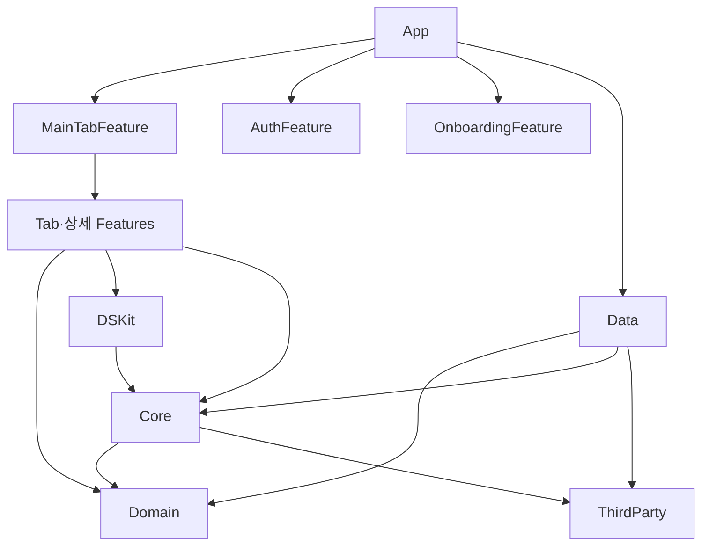

# PopPang 아키텍처

이 문서는 PopPang의 모듈 구조, 계층별 책임, 의존성 방향, 화면에서 서버까지의 데이터 흐름을 정리한다. 계획을 세우거나 새 기능을 만들기 전에 먼저 읽는다.

코드와 이 문서가 다르면 현재 코드를 기준으로 판단한다. 코드 변경으로 이 문서의 구조나 규칙이 바뀌면 같은 작업에서 문서도 고친다.

## 목차

- [한눈에 보기](#한눈에-보기)
- [모듈 지도](#모듈-지도)
- [계층별 책임](#계층별-책임)
- [의존성 방향](#의존성-방향)
- [데이터 흐름](#데이터-흐름)
- [앱 시작 흐름](#앱-시작-흐름)
- [주요 기술](#주요-기술)
- [새 기능 개발 체크리스트](#새-기능-개발-체크리스트)
- [변경 전 영향 범위를 명시할 대상](#변경-전-영향-범위를-명시할-대상)
- [관련 문서](#관련-문서)

## 한눈에 보기

| 항목 | 현재 기준 |
| --- | --- |
| UI | SwiftUI. 목록 화면은 PopPangListKit(UICollectionView 기반 선언형 목록 DSL) |
| 상태 관리 | TCA(The Composable Architecture). `@Reducer`, `@ObservableState`, `Store` |
| 화면 전환 | TCA tree-based(`@Presents` destination)와 stack-based(`StackState` path) navigation |
| 의존성 주입 | composition root(`AppBootstrap`)에서 usecase를 조립하고 TCA `DependencyValues`로 주입 |
| 네트워크 | Moya와 async/await wrapper(`MoyaProvider.asyncRequest`) |
| 프로젝트 구성 | Tuist. 모듈마다 손으로 쓴 `Project.swift`(ProjectDescriptionHelpers 없음). 버전은 [Tuist 문서](../development/tuist.md#기준-버전) |
| 배포 대상 | iPhone, iOS 17.0 |

## 모듈 지도

```text
Projects
├── App                       앱 진입점, SDK 초기화, composition root, AppFeature(루트 navigation)
├── Features
│   ├── MainTabFeature        로그인 이후 탭과 탭 공통 push·fullScreen 소유
│   ├── HomeFeatureV2         홈 탭 (MainTabFeature가 사용하는 홈)
│   ├── CalendarFeature, MapFeature, FavoritesFeature, ProfileFeature
│   ├── AuthFeature, OnboardingFeature
│   ├── PopupDetailFeature, ReviewFeature, SearchFeature, AlertFeature
│   ├── MaintenanceFeature    앱 시작 헬스 체크 실패 시 점검·오프라인 안내 화면
│   └── PopPangRNFeature      React Native 화면 호스트 (팝업 제보·관리)
├── Domain                    Entity, Repository 계약, Usecase 계약과 구현
├── Data                      Repository 구현, Moya API target, DTO, DTO↔Entity 변환
└── Shared
    ├── Core                  네트워크 공통, 로컬 저장소, 로깅, 세션 모델, 확장
    ├── DSKit                 디자인 시스템, 공통 UI, 폰트·색상·이미지 리소스
    ├── ADKit                 AdMob 네이티브 광고 런타임
    └── ThirdParty            외부 SDK product를 모으는 링크 허브
```

각 모듈의 product type과 프로젝트 의존성은 아래와 같다(각 `Project.swift` 기준). 모듈을 추가하거나 의존성을 바꾸면 이 표를 고친다.

| 모듈 | product | 프로젝트 의존성 | 추가 타깃 |
| --- | --- | --- | --- |
| App (`PopPangApp`) | app | ADKit, AuthFeature, OnboardingFeature, MainTabFeature, MaintenanceFeature, Domain, Data, ThirdParty, Core, DSKit, React Native local package | 없음 |
| Domain | framework | 없음 | 없음 |
| Data | framework | Domain, Core, ThirdParty | `DataTests` |
| Shared/Core | framework | Domain, ThirdParty | `CoreTests` |
| Shared/DSKit | framework | Core, ThirdParty | Demo (컴포넌트 카탈로그, 탭바 비교) |
| Shared/ADKit | framework | Core, GoogleMobileAds, JavaScriptCore | 없음 |
| Shared/ThirdParty | framework | 외부 패키지만 | 없음 |
| MainTabFeature | staticFramework | Alert, Calendar, Favorites, HomeFeatureV2, Map, PopupDetail, PopPangRN, Profile, Review, Search Feature, Domain, Core, DSKit | `MainTabFeatureTests` |
| HomeFeatureV2 | staticFramework | ADKit, Domain, DSKit, Core, ThirdParty | Demo, `HomeFeatureV2Tests` |
| Alert, Calendar, Favorites, PopupDetail, Profile Feature | staticFramework | Domain, Core, DSKit, ThirdParty | Demo |
| MapFeature, SearchFeature | staticFramework | Domain, DSKit, Core, ThirdParty | Map만 Demo |
| Auth, Onboarding, Review Feature | staticFramework | Domain, DSKit, ThirdParty | 없음 (Demo 주석 처리) |
| MaintenanceFeature | staticFramework | DSKit | Demo |
| PopPangRNFeature | framework | ThirdParty, React Native local package | 없음 |

## 계층별 책임

### App

위치: `Projects/App`

- `PopPangApp`이 앱 진입점이다. `AppSDKInitializer.configure()`로 SDK를 초기화하고, `AppBootstrap.live()`로 의존성 그래프를 만든 뒤 root `Store`를 앱 수명 동안 하나만 유지한다.
- `AppDependencyRegistry`가 Repository 구현체와 Usecase 구현체를 만든다.
- `AppBootstrap`이 feature-scoped client를 조립하고 `makeAppStore()`의 `withDependencies`로 주입한다. 자세한 내용은 [의존성 주입](dependency-injection.md)을 본다.
- `AppFeature`와 `AppRootFlowView`가 launch, onboarding, auth, register, main 루트 전환을 소유한다.
- Info.plist, entitlements, 앱 리소스, 딥링크(`AppDeepLinkHandler`), 푸시(`AppNotificationManager`)를 관리한다.

넣지 않을 것: 화면별 비즈니스 규칙, 특정 탭의 상태.

### Features

위치: `Projects/Features/<Name>Feature`

- 화면 하나 또는 흐름 하나를 TCA reducer(`<Name>Feature`)와 SwiftUI view(`<Name>FeatureView`)로 구현한다.
- 서버나 저장소 작업은 feature-scoped client(`Sources/Dependency/<Name>Client.swift`)를 통해서만 한다.
- 다른 화면으로 가야 하면 `.delegate(...)` action으로 의도만 올린다.
- 기본 폴더 구성은 `Sources/Presentation`, `Sources/Dependency`, `Demo/Sources`(데모 앱), `Tests`(있는 경우)다.

넣지 않을 것: 다른 feature 조립(`MainTabFeature` 제외), 화면 전환용 escaping closure, DTO·Moya 타입.

`MainTabFeature`는 navigation owner라서 예외적으로 탭 feature와 상세 feature를 import한다. 다른 feature끼리는 서로 의존하지 않는다.

탭바 모양은 `MainTabFeatureView`의 `tabBarStyle`(DSKit `PopPangTabBarStyle`)로 고르고, 값은 `AppRootFlowView`에서 정한다.

- `.classic`: 시스템 탭바를 숨기고, 기존 모양을 그대로 옮긴 `PopPangTabBar`를 붙인다.
- `.system`: 시스템 탭바를 쓴다. Xcode 27부터는 `UIDesignRequiresCompatibility`가 무시되어 Liquid Glass로 그려진다.

두 모양은 DSKit 데모의 탭바 비교 화면에서 비교한다. 실행 인자 `-tabBarStyle system` 또는 `-tabBarStyle classic`으로 고른다. 탭바 높이가 필요한 화면은 `@Environment(\.popPangTabBarStyle)`로 스타일을 확인한다(예: `MapFeatureView`의 목록 보기 버튼).

### Domain

위치: `Projects/Domain`

- `Sources/Entities`: `Popup`, `User`, `Review`, `RegionList` 같은 비즈니스 모델
- `Sources/RepositoryProtocol`: `<Name>RepositoryProtocol` 데이터 접근 계약
- `Sources/Usecase/Protocols`: `<Name>UsecaseProtocol` 기능 계약
- `Sources/Usecase/Implementations`: `<Name>UsecaseImpl` 구현. 대부분 Repository에 위임한다.

넣지 않을 것: 다른 프로젝트 모듈 import, DTO, Moya·SDK 타입. public protocol을 바꾸면 Data, App 조립, feature client가 함께 바뀐다.

`Sources/Dependency/DIContainer.swift`는 생성된 project graph가 경로를 참조해서 남겨 둔 빈 placeholder다. 새 코드에서 쓰지 않는다.

### Data

위치: `Projects/Data`

- `Sources/Remote/<Name>API.swift`: Moya `TargetType`. `Core`의 `BaseAPI`를 채택해 base URL과 header를 공유한다.
- `Sources/RepositoryImpl/<Name>RepositoryImpl.swift`: Domain 계약을 구현한다. `NetworkProvider.shared`로 `MoyaProvider`를 만들고 `asyncRequest(_:decodeTo:)`로 요청한다.
  - 예외: `ServerHealthRepositoryImpl`(앱 시작 헬스 체크)은 `URLSession`으로 직접 요청한다. 오프라인 여부를 `URLError` 코드로 구분하고 요청 전체를 5초로 제한하기 위해서다. 요청 주소와 헤더는 `ServerHealthAPI`(`BaseAPI`)로 만든다.
- `Sources/DTO`: 서버 응답·요청 형식
- `Sources/Mapping/<Entity>+DataMapping.swift`: DTO↔Entity 변환. 일부 DTO는 DTO 파일 안의 `toEntity()` extension으로 변환한다.
- 카카오·구글·애플 로그인 SDK 연동 구현

넣지 않을 것: DTO를 Domain이나 Feature로 노출하는 코드, 화면 상태.

### Shared

| 모듈 | 맡는 일 | 주의 |
| --- | --- | --- |
| `Core` | `Network`(BaseAPI, NetworkProvider, MoyaProvider+Async, NetworkError), `LocalStorage`(Session, PushToken, RecentSearch, DeepLink), `Logging`, `Support`(AppConfig, `UserSession` 등), Foundation 확장 | `BaseAPI`, `NetworkProvider`, `MoyaProvider+Async`를 바꾸면 모든 네트워크 호출에 영향이 있다. |
| `DSKit` | 디자인 시스템, 공통 컴포넌트, 폰트·색상·이미지(`DSKitResource`) | 두 개 이상의 feature에서 쓰거나 디자인 시스템 성격이 분명할 때만 올린다. |
| `ADKit` | Google Mobile Ads 초기화와 네이티브 광고, 목록에 광고를 끼워 넣는 `AdInjectedListItem` | `GoogleMobileAds`를 직접 링크한다. 광고 ID는 `Secrets.xcconfig`의 `ADMOB_APP_ID`, `ADMOB_NATIVE_AD_UNIT_ID`에서 읽는다. |
| `ThirdParty` | 외부 SDK product 선언을 모으는 허브 | `@_exported import`로 재노출하지 않는다. 사용하는 파일에서 실제 SDK 모듈을 import한다. 자세한 기준은 [모듈 구조](modules.md)를 본다. |

## 의존성 방향

코드가 참조하는 방향은 아래와 같다. 화살표는 소스 코드의 import 방향이며, 실행 중 결과가 돌아오는 방향과는 다르다.



| 사용하는 쪽 | 참조할 수 있는 모듈 | 참조하지 않는 모듈 |
| --- | --- | --- |
| `Domain` | 표준 라이브러리 | 모든 프로젝트 모듈 |
| Feature | `Domain`, `Core`, `DSKit`, `ThirdParty`, 필요하면 `ADKit` | `Data`, 다른 Feature(`MainTabFeature` 제외) |
| `MainTabFeature` | 위 목록과 탭·상세 Feature | `Data` |
| `Data` | `Domain`, `Core`, `ThirdParty` | Feature, `App` |
| `DSKit` | `Core`, `ThirdParty` | Feature, `Data` |
| `Core` | `Domain`, `ThirdParty` | Feature, `Data` |
| `App` | 조립에 필요한 모든 모듈 | 다른 모듈이 `App`을 참조하지 않는다. |

Demo 앱 타깃은 mock 대신 실제 Repository를 쓰기 위해 `Data`를 참조할 수 있다. Feature 본체 타깃은 `Data`를 참조하지 않는다.

## 데이터 흐름

홈 화면이 팝업 목록을 불러오는 실제 흐름이다.

```text
HomeFeatureView (HomeFeatureV2)
  → store.send(.onAppear)
  → HomeFeature reducer: state.isLoading = true, loadAllPopupData(...)가 Effect.run 반환
  → @Dependency(\.homePopupClient) HomePopupClient.getPersonalRandomPopupList(userUuid) 등 3개 요청을 async let으로 동시에 실행
  → PopupUsecaseProtocol.getPersonalRandomPopupList(userUuid:)     (Domain, AppBootstrap에서 주입)
  → PopupUsecaseImpl → PopupRepositoryProtocol                     (Domain)
  → PopupRepositoryImpl                                            (Data)
  → MoyaProvider<PopupAPI>.asyncRequest(_:decodeTo: [PopupDTO].self)
  → PopupDTO.toEntity() → [Popup]
  → send(.popupSectionsLoaded(HomePopupSections(...))) → reducer가 state 갱신 → view 다시 그림
```

- 실패는 `Core`의 `NetworkError.invalidStatusCode(_:message:)` 또는 Moya 오류로 올라온다. reducer는 `send(.errorMessageChanged(error.localizedDescription))`처럼 화면 상태로 바꾼다.
- 성공·실패와 관계없이 마지막에 `send(.loadingChanged(false))`로 로딩을 끝낸다.
- 이 흐름에서 feature reducer는 Repository, Moya, DTO를 모른다.

## 앱 시작 흐름

1. `PopPangApp.init`이 `AppSDKInitializer.configure()`를 호출한다.
2. `AppBootstrap.live()`가 `LocalSessionStorage`, `AppDependencyRegistry`, `LocalSessionClient`, `MainTabFeatureDependencies`를 만들고 `AppNotificationManager`를 설정한다.
3. `makeAppStore()`가 `AppFeature` store를 만들고 의존성을 주입한다.
4. `AppRootFlowView`가 `.launch`에서 `launchTask`를 보낸다. 확인이 1.5초를 넘기면 시작 이미지 위에 로딩 표시를 띄운다.
5. `AppFeature.resolveLaunch()`가 서버 헬스 체크(`ServerHealthClient`, `GET /api/v1/health`, 최대 5초)와 자동 로그인(`LocalSessionClient.load()`)을 동시에 시작한다.
6. 헬스 체크 결과에 따라 갈라진다.
   - 정상: `LocalSessionStorage.loadSnapshot()`과 세션으로 `AppLaunchStateResolver`가 시작 화면을 정하고, `launchResolved`에서 `session`과 `destination`을 반영한다. main이면 `MainTabFeature.State`를 만든다.
   - 서버 이상·오프라인: `serverHealthCheckFailed`로 `.maintenance` 화면(`MaintenanceFeatureView`)을 띄운다. 저장된 로그인 정보는 지우지 않는다.
7. 점검 화면의 다시 시도(`maintenanceRetryTapped`)는 5번부터 다시 실행한다. 확인 중에 누른 버튼은 무시한다.

## 주요 기술

| 기술 | 쓰는 곳 |
| --- | --- |
| ComposableArchitecture | 모든 feature reducer와 navigation |
| Moya | `Data`의 API target과 `Core`의 네트워크 공통 |
| Kingfisher | 이미지 로딩·캐시 |
| PopPangListKit | 목록 화면 ([PopPangListKit 문서](poppang-listkit.md)) |
| Firebase(Core, Analytics, Messaging) | 푸시와 Analytics. App에서 직접 import한다. `trackScreen(_:)` modifier(`FirebaseLogger.swift`)는 있지만 호출하는 곳이 없다. |
| KakaoSDK, GoogleSignIn, AuthenticationServices | 소셜 로그인 |
| Google Mobile Ads | `ADKit` 네이티브 광고 |
| NMapsMap | 지도 탭 |
| BottomSheet | 지도·상세 바텀시트 |
| React Native | `PopPangRNFeature`의 팝업 제보·관리 화면 |

외부 패키지의 버전과 product type은 `Tuist/Package.swift`에서 확인한다.

## 새 기능 개발 체크리스트

서버 데이터를 쓰는 화면이라면 아래 순서로 경계를 확인한다. 필요 없는 계층은 건너뛴다.

### 1. Domain에서 계약을 정한다

- [ ] 필요한 Entity가 `Domain/Sources/Entities`에 있는지 확인한다. 화면 표시용 문자열이나 DTO 필드명은 넣지 않는다.
- [ ] `<Name>RepositoryProtocol`과 `<Name>UsecaseProtocol`에 메서드를 추가하고 `<Name>UsecaseImpl`에서 구현한다. public protocol 변경이므로 계획에 적는다.

### 2. Data를 연결한다

- [ ] `Remote/<Name>API.swift`에 case와 path·method·task를 추가한다.
- [ ] DTO와 `toEntity()`·`toDTO()` 변환을 추가한다.
- [ ] `<Name>RepositoryImpl`에서 `asyncRequest`로 구현한다.

### 3. Feature를 만든다

- [ ] 새 모듈이 필요하면 [모듈 구조](modules.md)의 절차로 만든다.
- [ ] `Sources/Dependency/<Name>Client.swift`에 feature-scoped client를 만든다. ([의존성 주입](dependency-injection.md))
- [ ] reducer와 view를 [TCA Feature 작성 규칙](tca-feature.md)에 맞춰 만든다. 목록이면 [PopPangListKit](poppang-listkit.md)을 따른다.
- [ ] 다른 화면으로 가는 지점은 delegate action으로 올린다.

### 4. App과 parent에 연결한다

- [ ] `AppBootstrap` 또는 `MainTabFeatureDependencies`에서 client의 `.live(...)`를 조립해 주입한다.
- [ ] parent(`MainTabFeature` 등)에 child state·action·`Scope`와 delegate 처리를 추가한다. ([TCA Navigation](tca-navigation.md))

### 5. 검증하고 문서를 맞춘다

- [ ] reducer 테스트와 빌드를 실행한다. ([테스트](../development/testing.md))
- [ ] 바뀐 구조를 이 문서와 관련 문서에 반영한다.

## 변경 전 영향 범위를 명시할 대상

아래를 바꾸는 계획에는 영향 범위를 적고 승인을 받는다.

- API 계약, DTO, Domain entity, public protocol
- DI 등록(`AppDependencyRegistry`, `AppBootstrap`, `MainTabFeatureDependencies`)
- TCA path·destination, 루트 전환
- 모듈 의존성, Tuist package·product type
- Info.plist, entitlements, signing 설정, secret·config 파일

## 관련 문서

- [TCA Feature 작성 규칙](tca-feature.md)
- [TCA Navigation](tca-navigation.md)
- [의존성 주입](dependency-injection.md)
- [PopPangListKit](poppang-listkit.md)
- [모듈 구조](modules.md)
- [테스트](../development/testing.md)