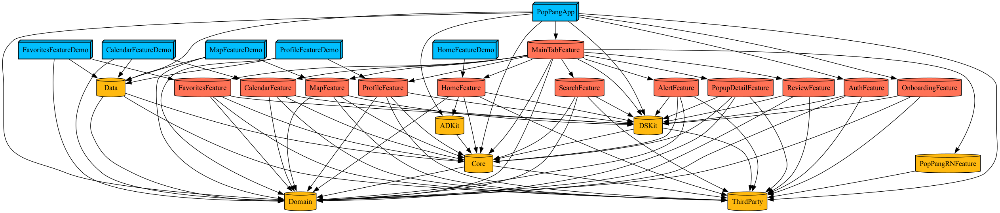
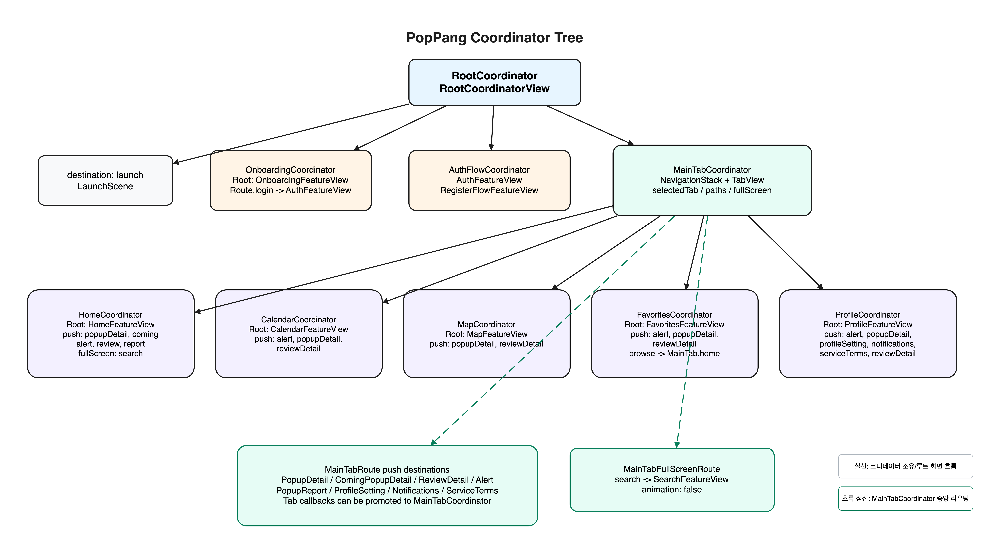

<div align=center>

# PopPang
### **팝업스토어 키워드 알리미**
팝업에 관심은 있지만 매번 검색하기 번거롭나요?  
PopPang은 관심있는 팝업 정보를 놓치지 않도록, 실시간으로 전해드립니다.  
<br/><br/>

<div align="center">
  
</div>

</div>
<br/><br/>

# 1. 기능 소개

1. 키워드를 등록해 원하는 팝업 알림 받기
2. 검색·필터로 보고 싶은 팝업 바로 찾기
3. 달력에서 날짜별 팝업 일정 확인하기
4. 지도로 내 주변 팝업 한눈에 보기
5. 관심 팝업을 찜해 나만의 리스트로 관리하기
6. 상세 정보, 공유, 외부 링크, 리뷰 흐름까지 한 번에 이용하기

<br/><br/>

# 2. 기술 스택

| library | description |
|:---:|:---:|
| **Tuist** | Micro Feature Architecture 기반 workspace와 project를 구성하기 위함 |
| **TCA** | Feature 단위 MVI 상태 관리를 위함 |
| **FirebaseSDK** | FCM 푸시 알림과 Analytics를 구현하기 위함 |
| **KakaoSDK** | 카카오 소셜 로그인과 카카오 공유를 구현하기 위함 |
| **GoogleSignIn** | 구글 소셜 로그인을 구현하기 위함 |
| **Moya** | 추상화된 네트워크 레이어를 보다 간편하게 사용하기 위함 |
| **Kingfisher** | 이미지 캐싱 처리 및 UI 성능 개선을 위함 |
| **NMapsMap** | 지도 기반 팝업 탐색 기능을 구현하기 위함 |
| **BottomSheet** | 지도와 상세 흐름의 바텀시트 UI를 구현하기 위함 |
| **PopPangListKit** | 직접 제작한 UICollectionView 기반 선언형 목록 DSL 라이브러리 |

<br/><br/>

# 3. 모듈 의존성 그래프

<div align="center">
  
</div>

<br/><br/>

<!-- # 4. 코디네이터 트리

<div align="center">
  
</div> -->

<br/><br/>

# 4. 핵심 성과

<!--
### **1. 선언형 List DSL로 UIKit과 SwiftUI 목록 구현 통합**
> **문제**
>
> SwiftUI `List`는 표준 목록을 빠르게 만들기 좋지만 복잡한 scroll lifecycle, prefetch, pagination과 업데이트 전략을 직접 제어하기 어려웠음. 
> 반대로 `UICollectionView`는 동작을 예측하고 튜닝할 수 있지만 화면마다 data source와 delegate 연결 코드가 반복됐음
>
> **해결**
>
> `UICollectionView`와 DifferenceKit을 Core로 유지하면서 `List`, `Section`, `Cell`로 구성하는 선언형 DSL을 구현  
> 기존 UIKit `Component`와 SwiftUI `View`가 같은 diff, layout, event 경로를 공유하도록 `PopPangListKit` 외부 라이브러리로 분리
>
> **성과**
>
> 🔸 UIKit의 cell reuse, compositional layout과 scroll 제어를 유지하면서 선언형 목록 작성 가능  
> 🔸 UIKit Component와 SwiftUI View를 하나의 Section에서 함께 사용  
> 🔸 DifferenceKit 기반 변경 중심 batch update와 `reloadData()` fallback 제공  
> 🔸 Binding Cell과 최신 snapshot 병합으로 Toggle 같은 입력 상태를 안정적으로 갱신  
> 🔸 framework와 tests는 **iOS 13+**, Demo app은 **iOS 17+** 지원  

```swift
struct PopupListView: View {
    @State private var popups: [Popup] = []

    var body: some View {
        PopPangList {
            Section(id: "popups") {
                for popup in popups {
                    Cell(id: popup.id, item: popup) { popup in
                        PopupRow(popup: popup)
                    }
                }
            }
            .withSectionLayout(VerticalLayout(spacing: 8))
        }
    }
}
```

-->

---

### **1. 로딩 지연 문제 개선**
> **문제**  
> 초기 화면에서 여러 API를 `await`로 순차 호출해, 앞선 요청이 끝난 뒤에 다음 요청이 시작됐음.  
> 비동기 요청이었지만 호출 구조가 직렬이라 각 응답 시간이 누적돼 초기 화면 로딩이 길어졌음.  
>
> **해결**  
> 서로 의존하지 않는 API 요청을 `TaskGroup`인 `withThrowingTaskGroup`의 독립 Task로 분리하고, `addTask`로 병렬 실행하도록 전환.  
> 부모 Task에서는 `for try await`로 완료된 결과를 수집하고, `MainActor.run`에서 각 목록 상태를 갱신해 UI 업데이트를 메인 스레드에 한정했음.  
>
> **성과**  
> 🔸 실제 API 기준 응답 시간 **1.2ms → 0.7ms**로 단축해 약 **40%** 개선<br>
> 🔸 새 API가 추가되어도 `addTask`만 추가하면 기존 병렬 처리 구조를 유지할 수 있게 구성

```swift
func getAllPopupData() async {
    do {
        try await withThrowingTaskGroup(of: (Int, [Popup]).self) { group in
            group.addTask { (0, await self.getPersonalRandomPopupList()) }
            group.addTask { (1, await self.getPersonalUpcomingPopupList()) }
            group.addTask { (2, await self.getPersonalFilteredPopupList()) }

            for try await (index, popups) in group {
                await MainActor.run {
                    switch index {
                    case 0: self.bestPopups = popups
                    case 1: self.comingPopups = popups
                    case 2: self.gridPopups = popups
                    default: break
                    }
                }
            }
        }
    } catch {
        Logger.e("❌ 로딩 실패: \(error)")
    }
}
```

---

### **2. Moya를 async/await으로 사용하기 위한 공통 async 래퍼 생성**
> **문제**  
> Moya는 completion 기반이라 async/await과 직접 호환되지 않아  
> API마다 동일한 변환 코드가 반복됨  
>
> **해결**  
> `withCheckedThrowingContinuation` 기반 **공통 async 변환 래퍼** 구현  
>
> **성과**  
> 🔸 Repository 전역에서 동일한 async 인터페이스 사용  
> 🔸 **중복 코드 감소 + 유지보수성 향상**

```swift
extension MoyaProvider {
    func asyncRequest(_ target: Target) async throws -> Response {
        try await withCheckedThrowingContinuation { continuation in
            self.request(target) { result in
                switch result {
                case .success(let response):
                    continuation.resume(returning: response)
                case .failure(let error):
                    continuation.resume(throwing: error)
                }
            }
        }
    }
}

let response = try await provider.asyncRequest(.getPopupList)
```

---

<!--
### **3. MainTabFeature에서 Feature 조립과 TCA 네비게이션 통합**
> **문제**  
> Feature가 다른 Feature를 직접 의존하면 화면 이동 하나를 변경해도 여러 모듈이 함께 영향을 받고,  
> 각 Feature의 독립성과 재사용성이 낮아짐
>
> **해결**  
> 메인 탭 하위 Feature의 조립과 화면 이동 책임을 `MainTabFeature`로 모으고,  
> 자식 Feature는 delegate action으로 이동 의도만 전달하도록 구성. 
>
> **성과**  
> 🔸 일반 Feature 사이의 직접 의존 제거    
> 🔸 화면 전환의 상태와 규칙을 `MainTabFeature`에서 한 번에 추적  
> 🔸 자식 Feature를 독립적으로 개발하고 테스트할 수 있는 경계 확보  
> 🔸 화면 이동 closure 없이 TCA state/action으로 네비게이션 표현   

```text
PopPangApp
├── AuthFeature
├── OnboardingFeature
└── MainTabFeature
    ├── HomeFeature
    ├── CalendarFeature
    ├── MapFeature
    ├── FavoritesFeature
    ├── ProfileFeature
    └── Search / PopupDetail / Review / Alert
```

`AppFeature`는 launch, onboarding, auth, register, main 전환을 소유하고,
`MainTabFeature`는 로그인 이후 자식 Feature와 탭 공통 화면 전환을 조립한다.

`MainTabFeature`는 자식 Feature의 상태와 화면 전환 규칙을 관리하는 reducer이고,
`MainTabFeatureView`는 해당 상태를 `TabView`, `NavigationStack`, `fullScreenCover`에 연결하는 View다.

```text
Home 검색 버튼
→ HomeFeature.delegate.searchRequested
→ MainTabFeature가 Search 상태 생성
→ MainTabFeatureView가 검색 화면 표시
```

- `Destination`: 검색이나 팝업 제보처럼 동시에 하나만 표시하는 full-screen/tree navigation
- `Path`: 팝업 상세나 리뷰처럼 화면이 순서대로 쌓이는 push/stack navigation
- 일반 Feature는 다른 Feature를 직접 import하지 않고 delegate action으로 이동 의도만 전달
- 제거 예정인 `PopupRequestFeature`, `PopupRequestManagementFeature`, `PopupSubmissionFormFeature` 조합만 임시 예외로 직접 참조 허용

```swift
case .home(.delegate(.searchRequested)):
    state.core.destination = .search(
        .init(
            userUuid: state.currentUser.userUuid,
            nickname: state.currentUser.displayNickname
        )
    )
    return .none
```

-->

---

### **3. MVVM에서 TCA로 상태 관리를 마이그레이션**
> **문제**<br>
> 여러 View에 ViewModel 상태 변경이 분산돼 상태 흐름을 추적하기 어려웠음.  
> 특히 Preview에서 공유 ViewModel 객체를 만들지 않거나 `.environmentObject()` 주입을 빠뜨릴 때마다 런타임 크래시를 반복적으로 겪었음.
> 
> **해결**<br>
> 단방향 상태 관리 기반의 TCA로 전환해 `State → Action → Reducer` 흐름에서 상태 변경을 한 곳으로 모아 관리.
>  
> **성과**<br>
> 🔸 상태 변경 경로를 일관되게 추적할 수 있게 구성<br>
> 🔸 `EnvironmentObject` 주입 누락으로 발생하던 런타임 크래시를 줄이고 상태 공유 방식을 단순화<br>
> 🔸 상태 변경을 독립적으로 검증할 수 있어 테스트 용이성 확보

### **4. 단일 타깃 구조를 Tuist 기반 Micro Feature Architecture로 전환**
> **문제**  
> 기존 `V0` 앱은 `App`, `Presentation`, `Util`, `DesignSystem`이 단일 타깃에 섞여 있어  
> 기능이 늘어날수록 변경 영향 범위가 커지고, 독립 개발과 빌드 검증이 어려웠음  
>
> **해결**  
> `App / Features / Domain / Data / Shared` 구조로 분리하고,
> `Tuist` 템플릿과 `Makefile` 래퍼로 feature, domain, data, core 모듈을 일관되게 생성하도록 구성  
>
> **성과**  
> 🔸 기능별 독립 모듈 개발 기반 확보  
> 🔸 App 조립, 화면 흐름, UI 기능, 도메인 규칙, 데이터 구현 책임 분리  
> 🔸 Demo app과 Core/Data 테스트를 통한 모듈 단위 검증 기반 확보  
> 🔸 클린빌드 평균 **129.447초 → 46.884초**로 개선, 모듈화 프로젝트가 약 **2.76배 빠름**  
> 🔸 증분빌드 평균 **6.415초 → 4.184초**로 개선, 모듈화 프로젝트가 약 **1.53배 빠름**

| 구분 | V0 | 모듈화 프로젝트 | 차이 |
|:---:|:---:|:---:|:---:|
| 클린빌드 평균 | 129.447초 | 46.884초 | 모듈화가 약 2.76배 빠름 |
| 증분빌드 평균 | 6.415초 | 4.184초 | 모듈화가 약 1.53배 빠름 |

| 측정 조건 | 값 |
|:---:|:---:|
| 반복 횟수 | 5회 |
| Destination | `generic/platform=iOS Simulator` |
| Configuration | `Debug` |
| V0 기준 | `V0/PopPang.xcodeproj`, scheme `PopPang` |
| 모듈화 기준 | `PopPang.xcworkspace`, scheme `PopPangApp` |
| 증분빌드 기준 | 파일 수정 없는 no-op 증분빌드 |

```text
Projects
├── App
├── Features
│   ├── AuthFeature
│   ├── OnboardingFeature
│   ├── MainTabFeature
│   ├── HomeFeature
│   ├── SearchFeature
│   ├── PopupDetailFeature
│   ├── MapFeature
│   ├── CalendarFeature
│   ├── FavoritesFeature
│   ├── ProfileFeature
│   ├── AlertFeature
│   └── ReviewFeature
├── Domain
├── Data
└── Shared
    ├── Core
    ├── DSKit
    └── ThirdParty
```

---

### **5. 외부 SDK 의존성을 ThirdParty 링크 허브로 추적 가능하게 정리**
> **문제**  
> 외부 SDK가 여러 레이어에 직접 흩어지면 어떤 모듈이 어떤 SDK product를 링크하는지 파악하기 어렵고,  
> SPM product type 문제로 빌드와 런타임 경고가 발생할 수 있었음  
>
> **해결**  
> 외부 SDK product는 `Projects/Shared/ThirdParty`에서만 `.external(...)`로 링크하고,  
> 실제 SDK 타입을 사용하는 파일은 `import Moya`, `import Kingfisher`, `import KakaoSDKShare`, `import NMapsMap`처럼 실제 모듈명을 명시  
>
> **성과**  
> 🔸 SDK 링크 지점 단일화  
> 🔸 `@_exported` 재노출 없이 실제 SDK 사용처 추적 가능  
> 🔸 Firebase, GoogleSignIn, KakaoSDK, Moya 등 product type 정책을 `Tuist/Package.swift`에서 관리

```swift
.target(
    name: "ThirdParty",
    product: .framework,
    dependencies: [
        .external(name: "FirebaseAnalytics"),
        .external(name: "FirebaseMessaging"),
        .external(name: "GoogleSignIn"),
        .external(name: "KakaoSDKUser"),
        .external(name: "Kingfisher"),
        .external(name: "Moya"),
        .external(name: "NMapsMap"),
    ]
)
```

---

### **6. CSV 기반 로컬라이제이션 자동화로 다국어 관리 비용 절감**
> **문제**<br>
> `Localizable.strings`를 언어별로 직접 관리하면<br>
> 키 누락, 오타, 언어별 불일치가 생기기 쉽고 문자열 키를 하드코딩할 때 디버깅 비용도 커졌음
>
> **해결**<br>
> `Python/localizable.csv`를 기준으로<br>
> `en/ko/ja Localizable.strings`와 `LocalizationKeys.swift`를 자동 생성하는<br>
> CSV 기반 로컬라이제이션 생성 스크립트 구축
>
> **성과**<br>
> 🔸 번역 데이터를 CSV 한 곳에서 일괄 관리<br>
> 🔸 `LocalizationKey` enum 자동 생성으로 문자열 오타 위험 감소<br>
> 🔸 번역 작업자, 기획자, 개발자가 같은 포맷으로 협업 가능

```swift
Text(LocalizationKey.commonNext.localized(comment: "Next button"))
```

<br/><br/>

# 5. 실행 방법

Tuist 버전은 `4.115.0`으로 고정합니다.

```bash
tuist version
tuist install
tuist generate
```

생성된 workspace를 정리 후 다시 만들 때는 아래 명령을 사용합니다.

```bash
make regen
```

빌드는 아래 명령으로 확인합니다.

```bash
tuist build PopPangApp
tuist build MainTabFeature
```

Core/Data 테스트는 아래 명령으로 실행합니다.

```bash
tuist test Core
tuist test Data
```

<br/><br/>

# 6. 모듈 생성 명령

```bash
make module LAYER=feature NAME=Home
make module LAYER=feature NAME=PopupDetail INTERFACE=true
make module LAYER=domain NAME=Popup
make module LAYER=data NAME=Popup
make module LAYER=core NAME=HTTPClient
make module LAYER=dskit NAME=DSKit
make module LAYER=shared NAME=UIComponents
```

<br/><br/>

# 7. 참고

- `AGENTS.md`: 저장소 작업 규칙과 아키텍처 기준
- [`Docs/tca-navigation-guidelines.md`](./Docs/tca-navigation-guidelines.md): MainTabFeature와 TCA navigation 기준
- [PopPangListKit](https://github.com/team-PopPang/PopPangListKit): UICollectionView 기반 선언형 목록 라이브러리와 UIKit·SwiftUI 사용 예제
- `V0/README.md`: 기존 단일 타깃 앱 README
- `Tuist/Package.swift`: 외부 의존성과 product type 정책
&nbsp;
